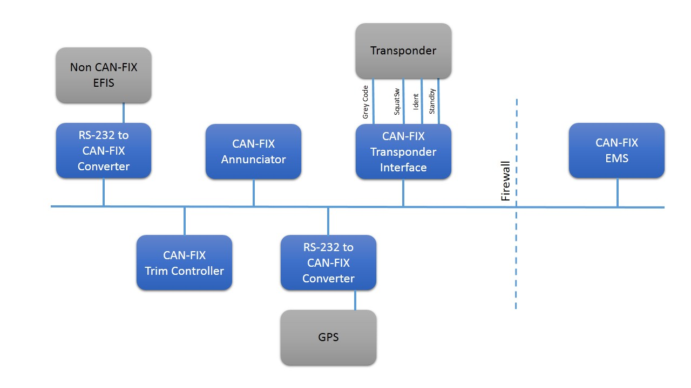
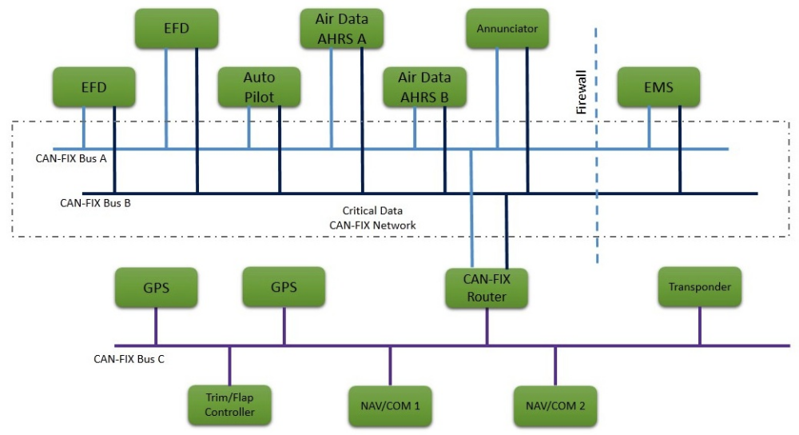

Introduction
============

FIX is an acronym for *Flight Information eXchange*.  It is a set of protocol
specifications for exchanging information between aircraft avionics and flight
systems.  This specification and the protocols themselves are licensed under a
Creative Commons license that allows anyone to modify and redistribute these
documents without charge.

This is a community supported endeavor, with the primary goal of providing a
standard method for avionics and flight control systems to communicate with one
other in a vendor neutral way.

The specifications and protocols are primarily geared toward the Experimental
Amateur Built (E-AB) aircraft community.  Keeping the specification open and
free allows aircraft builders to create their own devices and write their own
software that will be able to communicate with other devices without need to pay
for specifications or licenses.  It also encourages collaboration in the
development and improvement of the protocols themselves.

FIX is a protocol family.  This document will describe the CAN-FiX
implementation of the FIX protocol.  CAN-FiX is a CAN specific implementation of
the FIX protocol.

CAN® stands for Controller Area Network.  It was developed originally as a
robust message based protocol for use in automotive applications.  It has spread
to other uses, and is now found in medical equipment and industrial controls.

CAN is a message based, producer / consumer type protocol that involves one node
producing messages onto the CAN-bus and all other nodes receiving or consuming
those messages.  See the :ref:`References` section for more detailed
information on CAN.

CAN occupies most of the Physical Layer and all of the Data Link layer of the
OSI model.  The physical connection is not specified.  CAN-FiX will fill in the
physical connection specification as well as the Network, Transport, Session and
Presentation Layers.  CAN-FiX is a much simpler protocol than is described by
the OSI model so the correlation is not perfect, but it helps in the discussion.

CAN-FiX will be built upon the 2.0B version of CAN, but for the sake of
simplicity will only use the base frame format.  The base frame uses an 11 bit
identifier and that will give us the ability to send 2048 different types of
messages.  The extended frame format of CAN will be left for vendor device
implementations, or future versions if it becomes necessary.

CAN includes built-in arbitration and prioritization of message types.  We will
take advantage of this feature to make sure that higher priority parameters will
get communicated first.  The lower the identifier the higher the priority of
that parameter.

CAN priority arbitration is based on the idea of dominant and recessive bits.
If two nodes attempt to transmit different bits onto the network at the same
time, the dominant bit will win and the bus will actually attain the dominant
state.  The CAN network is synchronized so that nodes will begin each message at
the same time.  Each node is required to read the state of the bus as they are
transmitting.  If two nodes try to transmit at the same time, the first one to
transmit a recessive bit while another is transmitting a dominant bit will lose
the arbitration and should stop transmitting.  The node should try again later.
The dominant bit is a zero so the lower the number being transmitted the higher
the priority on the bus.  This is a very powerful feature of the CAN protocol
and one that we will exploit for CAN-FiX.

A complete discussion of the CAN protocol itself is beyond the scope of this
document.  For more information consult the data available on the internet.  You
will not have to look very far.  See the :ref:`References` section for more
information.

General Description
-------------------

A CAN-FiX network is made up of individual nodes.  Each node should be assigned
a unique Node ID between 1 and 255.  The Node ID is useful for establishing
communications to individual nodes on the network and identifying them
configuration and diagnostic systems.  Node ID 0 is used as the broadcast ID.

The normal use case of the network is for devices that are measuring a parameter
such as airspeed, altitude, engine data, GPS position, etc. to transmit that
data on the bus for other devices to read.  The data can then be displayed, used
in calculations, allowed to affect the operation of a system or recorded for
future analysis.

The network can also be used for configuration of nodes, retrieving specific
information about the node, downloading firmware as well as other uses.

It is also helpful if a node that transmits a particular parameter, also
transmit all the range and setup data associated with that parameter.  For
example, the alarm limits that are associated with the oil pressure should be
known and transmitted by the same node that is responsible for measuring the oil
pressure.  The reason for this is to maintain consistency between display or
recording devices.  Should the aircraft have two electronic flight displays
(EFD) and one annunciator each would have to be separately configured if we did
not send this information from the source node.  This is redundant and prone to
error and there is nothing in the system that would prevent display devices from
having different settings for any particular parameter.  At best this would be
confusing and potentially, a safety of flight issue.

CAN-FiX takes this one step further and adds an annunciate bit to each parameter
message so that devices can indicate a parameter that may be out of range.  One
of the reasons for this extra bit is to avoid nuisance alarms in the system, by
allowing the measuring node more control over when to annunciate and alarm above
and beyond a simple greater-than or less-than decision.

A good example of this is cylinder head temperature.  It makes sense to have a
low alarm limit on CHT.  It could indicate a failed sensor, a dead cylinder or
other problems.  When the engine is first started this would be in alarm because
the engine hasn't had a chance to initially warm up.  A simple less-than
calculation would annunciate this as an alarm, but a smarter device could use a
timer or the fact that the engine hasn't warmed up past a certain point yet to
inhibit the annunciation of this alarm even though the temperature is below the
threshold.  Hysteresis can also be added to alarms as well to keep alarms from
going in and out when the parameter is very close to an alarm limit.

All of this could be configured in display devices and annunciators, but
it makes more sense for the measuring node to be configured with this
information and transmit it to the receivers.  This way it
only has to be configured in one place and it is supposed that the device
which is actually measuring the parameter would better equipped to handle these
decisions properly.

Multiple networks can be installed and configured and data can be sent from one
to the other with routers.  Redundancy can be achieved by either duplicating
nodes and/or networks.  An example is given later in this specification.  If
there is a large amount of data, the networks can be segregated into logical
pieces and the common data transmitted from one network to the other with a
router.

Potential Applications
----------------------

:numref:`initial` shows one possible entry level use of CAN-FiX (CF).  There is
a non-CAN-FiX compatible EFIS system that is connected to an RS-232 to CAN-FiX
converter that would handle conversion between the native interface of the EFIS
and the CAN-FiX bus.

There is an annunciator that is connected to the CAN-FiX bus that could be used
to annunciate any parameter on the CAN-FiX bus.  The trim controller could read
the airspeed from the CAN-FiX bus and adjust the speed of the trim motors
accordingly. It would also present the trim positions to the bus so that they
could be displayed on the EFIS.

The transponder interface is interesting.  It acts like an encoder and can
accept the pressure altitude from the EFIS information (or another air data
source on the CAN-FiX bus) and use that to interface to the transponder.  It
could be Gray Code or Serial depending on the transponder and CAN-FiX interface.

Some transponders have a squat switch input that tells the transponder to switch
back to Standby after the aircraft lands.  The CAN-FiX interface could use the
ground speed from the GPS to determine when to signal this line.

The Engine Management system can be completely located in the engine
compartment, forward of the firewall.  This greatly reduces the number of wires
that have to pass through the firewall.  It also makes it easier to install and
maintain.

.. _initial:

   Possible CAN-FiX Configuration

Obviously this is a very minimal system but it gives an idea of what iS
possible.  More advanced installations could include CAN-FiX capable autopilots,
displays, radios, power systems, etc.

Eventually, if the technology becomes more widespread the entire avionics system
could be integrated with FIX.

.. _advanced:

   Advanced CAN-FiX implementation

:numref:`advanced` shows a much more advanced system.  There are three CAN-FiX
buses.  The first two (A & B) are used primarily for flight critical data and
they are redundant.  The most critical pieces are duplicated.  There are two
Electronic Flight Displays (EFD) and two Air Data / Attitude, Heading and
Reference Systems (AHRS).  Any single failure of this system will not cause loss
of data or control.  It can even handle multiple failures to some extent.

The bus C is for normal data that, although important, does not cause safety of
flight issues.  There is a router between these two buses that can be configured
to share data between them.

There is nothing stopping the end user from putting everything on the redundant
buses, or making all the equipment redundant.  Just like everything else in
aviation, it's about trade offs.  For a VFR / Day aircraft this would be much
too expensive.  The objectives of this protocol and the devices built with it
are modularity, simplicity and flexibility and, of course, reliability.

These are just imaginary examples of what can be done with the FIX protocols.
Obviously there could be thousands of different combinations of devices, some
CAN-FiX compatible and others that need adapters.  Some may even choose to use
very little of this in their aircraft.  Perhaps someone only uses it to
eliminate wires from the EMS to an Engine Display, and installs “steam gauges”
for everything else.  Another person may be building a “hard IFR in the flight
levels” kind of machine and want everything redundant.  It's all up to the
builder.
