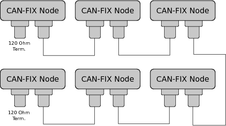
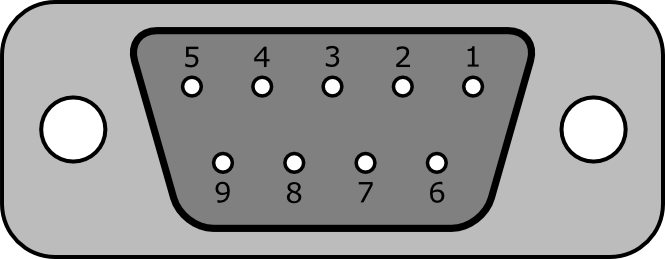
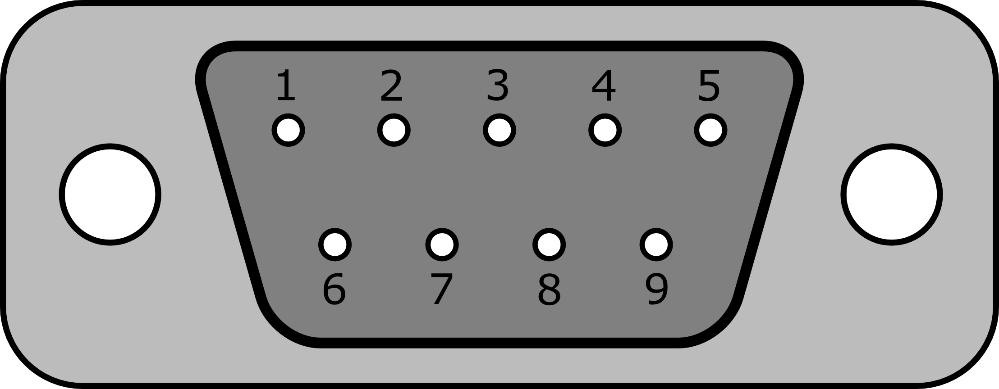

Physical Layer
==============

CAN is a daisy chained network.  This means that each node is connected to the
next in series.  It uses two conductors, CANH and CANL.  These are differential
signals, which means that signaling is done by inducing and measuring voltage
differences between the two wires.

.. _cannetwork:

   Example CAN-FiX Network

CAN networks must be terminated on both ends by a 120Ω resistor.  The CANL and
CANH conductors should be in shielded wire and the shield should be connected to
the main airframe ground on both ends of the network.

The primary connector for CAN-FiX is a DB-9 connector.  The devices themselves
should use two DB-9 connectors with the pins of one connector internally
connected to the corresponding pin on the other connector.  This allows for
daisy chaining of the network without having to solder or crimp multiple wires
into a single pin on the connector.   There is one exception.  The three RS-232
pins should not be internally connected.  There should be one male connector and
one female connector.  This allows for nodes to be removed.  The two cables can
then be connected to one another to maintain network integrity.  It also makes
it easier to insert additional nodes into the system.

Power can be supplied to the node through the power pins on the connector.  The
power can be daisy chained to the next device or each device can have it's own
power circuit.  This depends on how the installer wires up the connectors.  Some
nodes may need a power supply that requires more current than can safely be
handled with this connector.  Using the power supply pins in the CAN-FiX
connector for node power is optional, but the device should connect the power
supply pins on each connector to one another so that there will be no surprises
to the installer if the previous node and the next node use the connector power.

Although power can be added to either connector it is common for the power to be
sourced in the female cable connector.

The RS-232 connection is optional and it's use will be determined by the needs
of the individual device.  The RS-232 connectors should not be internally jumped
like the rest.  Each connector could be an independent RS-232 port for
configuration or normal use.  This should be well documented for each device.

.. _db9female:

   DB9 Female Connector

.. _db9male:

   DB9 Male Connector

:numref:`db9pins` Shows the function of the individual pins.

.. _db9pins:
.. csv-table:: CAN-FiX DB-9 Pin Descriptions
  :file: tables/db9pins.csv
  :header-rows: 1

Device manufacturers are free to use other connectors if it makes sense for the
individual design, but this is the CAN-FiX standard and should be used if
feasible.

The standard CAN bit rates for this specification are 125kbs, 250kbs, 500kbs and
1Mbs.  125kbs and 250kbs are mandatory.  Product documentation should clearly
indicate what CAN bit rates are available.
